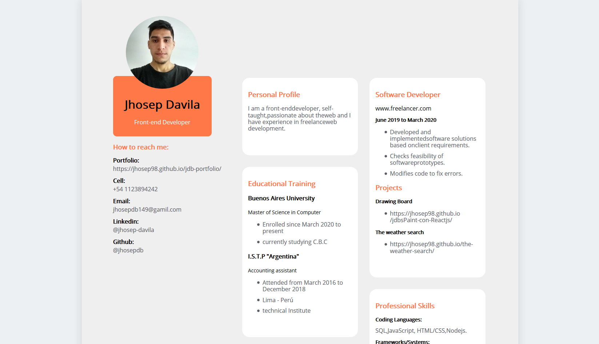

# Curriculum vitae en HTML5
> Converting my cv to HTML and integrating styles with sass.📃📝

## Table of contents

- [Screenshots](#screenshots)
- [Technologies](#technologies)
- [Contact](#contact)

## Screenshots

## Technologies

- Html
- Css
- Sass

## view project

[jhoset-cv](https://jhosep98.github.io/jhosep-cv/)

## Contact

Created by [@jhosep98](https://jhosep98.github.io/jdb-portfolio/) - feel free to contact me!
